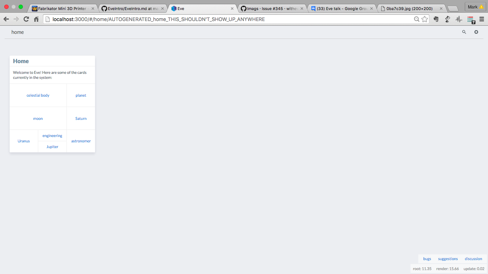
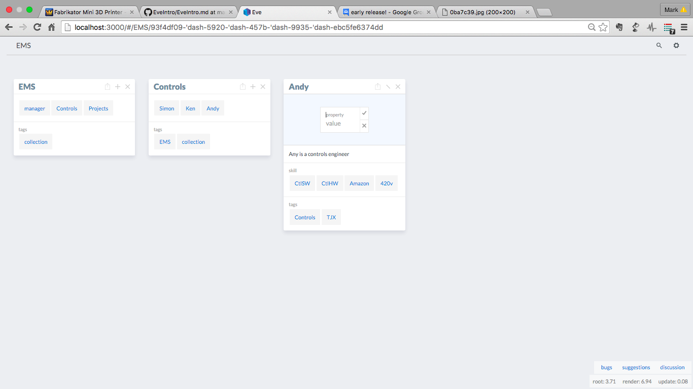
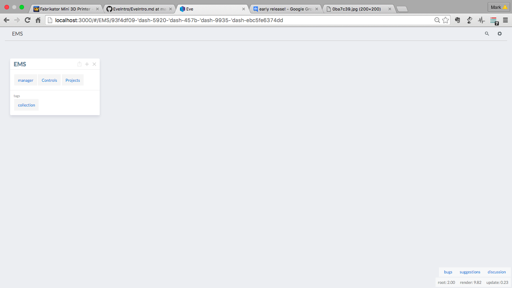
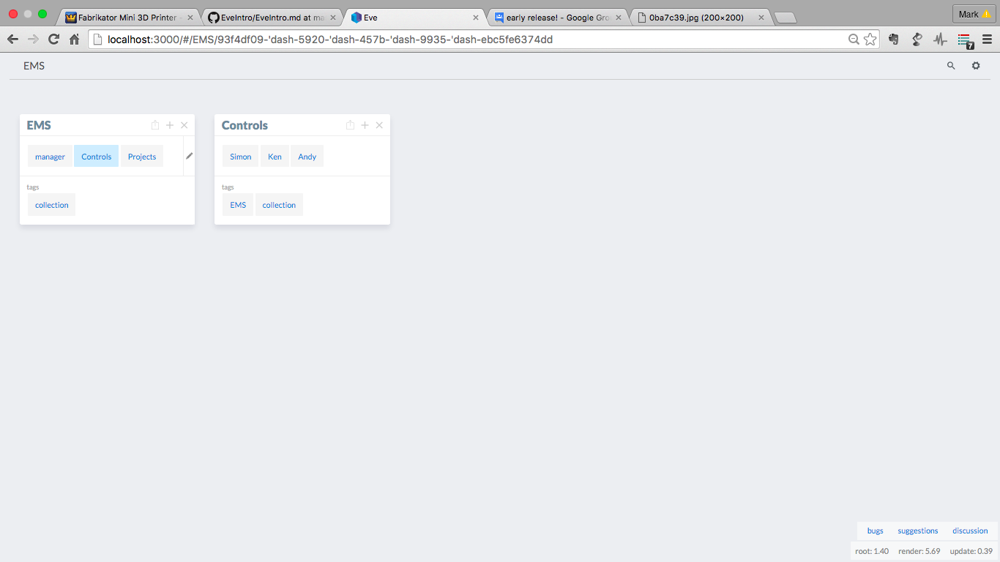
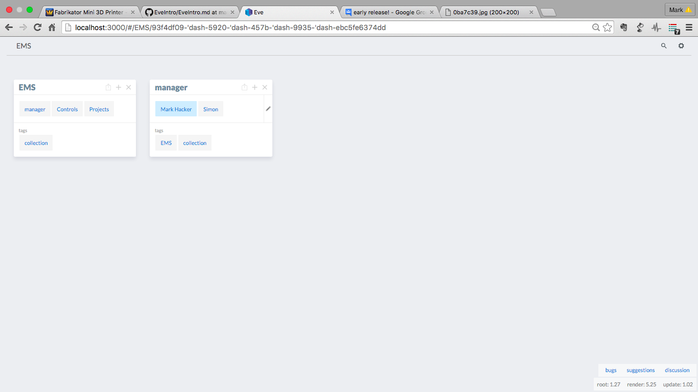
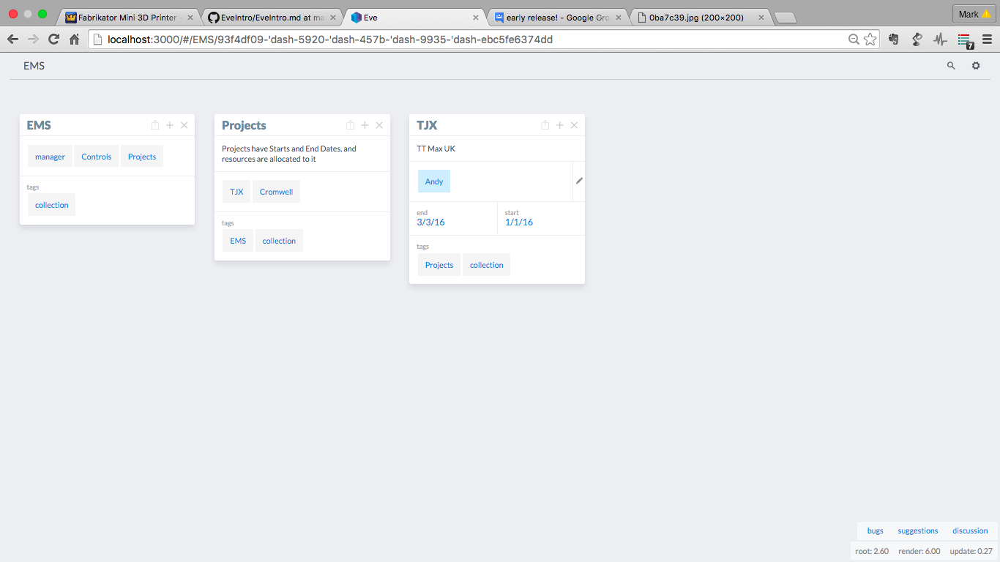
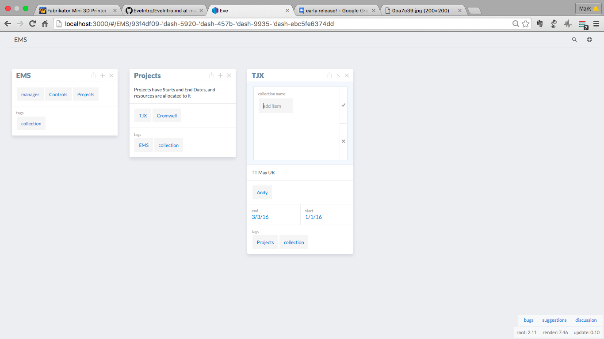
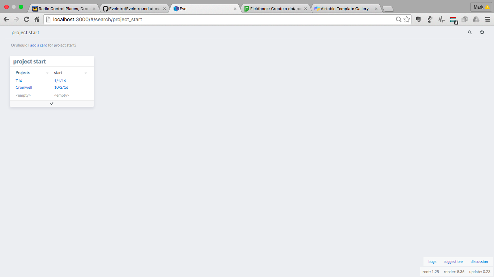

# Eve 
---
So you've found **Eve**, good choice, you're looking to unleash the power of your computer but to do real work, not simple examples, but with out getting bogged down in lines and lines of code to do even the simplest of things.
Think Excel, but with rocket boostera, for the web world.  
Eve is still under development however you'll experiance the potential and vision of a compelete re-thinking of how we programme and play with our data.

## Installation
As Eve is still very much in development, some understanding of developmentq, OS's, shells, Git, etc, system is required. 
Expect bugs, strange things, and pits to fall in, and constant change,
You'll need Git, node, brew and various other development tools installed.  
You'll need some knowledge about these things, there is too much layered understanding to cover in this introduction. Yon need to know a little bit of whats under the computers 'hood'. If you get errors go google, you wont find it here. Eve's been developed on Mac, I'm running a Mac.  Therefore if your 'off-piste' you're alone. 

First grab the lastest code from Git.

``git clone https://github.com/witheve/Eve.git``

Once you have the git reposity, It's a good idea to keep it up dated.
From inside the directory:

``git pull``

Do this regualary - keeps things intresting and up to date.

Now install **Eve**. Again from the Eve directory

``sudo npm install``

I found that I had to used 'sudo' to allow Eve is work due to write permissions for various folders.

This will take some time to compile and to get whats its needs.

``sudo npm run dev``

It will take some time to get eveything ready. Done?
Point your browser, recommend Chrome, to 

``http://localhost:3000/``

or there is demo online

``http://early.witheve.com/``

### Ready?
You should see the home screen something like this - I won't keep repeating myself but, it may look simular or totally different, things are always changing, Enjoy.  If you dont enjoy this - then best check back on **Eve** in a year or so. Either way no more warnings.

Once you have this we are ready to meet **Eve**.
Notice the **Eve** Icon on the top left?  Next is the Eve command bar.  The rest are web like pages and links.  Have a play, when your ready we'll begin.

## Example
The example I am going to build is a resource management system. It has the concept of **Engineers** and **Projects**.  Like all good things - Engineers get allocated to projects, and we'll use **Eve** query capabilites to see whats going on. 

Eve lets you cut and create data in different ways, it has a data logic programme language at its core, so it flexible. 

Eve has the concepts of cards, collections and properties.  Card the backbone of the data set, they can have properties and gathered into collections. Cards have a desctiption and can have an image.
All of which can be serachable and programmaztic accessed

It's an open system therefore you must think a little bit about what you want and how best to represent it, however this is not, normally, tricky as you know the problem and create what you need to represent it.

For the Resource system we will have Engineers, with skills, and Projects with start and stop dates.
Each engineering will have a card.   Skills will be added as properties to each engineering

Each Projects will also be a card which will add engineering as a collections.  Therefore you know which engineers are allocated to which project.

Lets start by entering a Engineer, just dive straight in, Eve will catch you.
In the command line type, at the top, type the engineers name;

``Andy``

Eve does not know about this top talent yet! Eve lets you create the page and we can expand the system by start adding links, referances and properties.

Hit the + key and add a description, via the descriptio tile, click the tick once you're done. 

Engineers have skills, there are added by Propertie. Again Press the + button and hit the properties files

Now the engineers have skills

See the Box with the up arrow?  That set that card to be the root card, most to left, to allow you expand and dig further.

Eve now lets us group things together in collections, the grouping depends on what you are doing. For this resource managment system, the EMS, we have  Controls Engineers and managers.  Which are allocated to Projcts

So we create those cards, and we crate a EMS card. The add manager, control and projects, via collections, to the EMS card.

Adding collections to card is easy, click the + again, collection tile and just type the card you want to add to the collection within the card

This is simple yet powerful, properties and collections allow you to organise your data in many way, that allow you create relations and databases of your data.  Just have a quick thing how best to do it before dving straight in.

The managers card is added in the same way, new card; Manager, add the engineering as a collections.

Now lets add some projects.

Now the clever stuff

You simple add the engineering card, Andy into the project. Collection

You can building and links cards together into collections.  The collection can be however the data is needed.  The collection are simply created by ``+`` tthen click on collection tile.  Just type card (or collection -nice) that you want to link.  This quickly makes complex webs of data that are simple to easy to naviagte and are always in contect. Andy is a engineer, whos in controls, who on the TJX project.

You can add properties - anything that make sence - to a card.  They can then be used in more powerful way, as we'll see with search and query.

### Addd Images and Descriptions

Once you started added cards you may want to build upon them.  Eve lets you add text descriptions and images.

try exploring the planets again.

Adding a description is easy, ``+`` then click on Description tile.  In the text add what you like, click the tick.

Images (due to web sercurity issues) need to hosted somewhere, but again are added  ``+``, images.  Copy the URL, click-the-tick.

Hosting images can be a pain <roadmap> I use github, add a annoying step in an otherwise simple process.

## Serach and query
Now that we have build the data, which we ready navigate 

### Search
Search is simple, just seach for what you want in the Eve bar, it will become the root level card. For exmaple

``Andy``

Will Bring the Andy card to the top level. 

Search is fuzzy which means it more like google, it will look past capital letter, spaces, underscore etc.

Therefore, try ``EMS`` and ``ems``.  This is nice because it makes Eve human and accessbale due to a little imprecresion.

Deep seach which results in tables, try ``project start``.  Project is a card collection, and start is properties - the search make the connection for you.

That a table generated - which can be made into a card - giving all your project start dates - a range of properties across cards.

### Query
Eve query lets you do a little more.  It based on 'natural languge' so that you build english like sentances to ask questions about your data.  

Try some of the following:

``how many controls?``

Presents you with nice table - which you can save as another card 

More 'programmitic'

``count control``

Give a simple card, with the count.  You can dismiss it, or save (add) it as a card for future referance.

``count control amazon``

Will count all the control engineers with amazon knowledge.
So it trys to understand both your cards and propertries, with thoses card.

``control amazon`` lists them - then they are just a click away

Think google for your data.

## REPL
Eve also has REPL, Read–eval–print loop, system for the brave and allows you to driver deeper.

``sudo npm run dev`` 

WHICH IS BROKEN AT THE MOMENT :

---

                ,'`.          
             ,'      `.       
          ,'`.        | `.    
       ,'      `.     |    `.
      |`.     ,' |    |     | 
      |   `.'    |    |     | 
      |    |     |  ,'`.    | 
      |    |     |'      `. | 
       `.  |     `.        ;' 
          `|,       `.  ,'   
             `.      ,'      
                `.,'         

