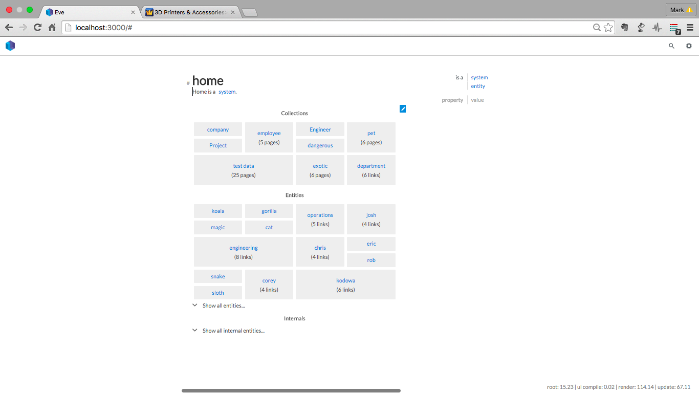
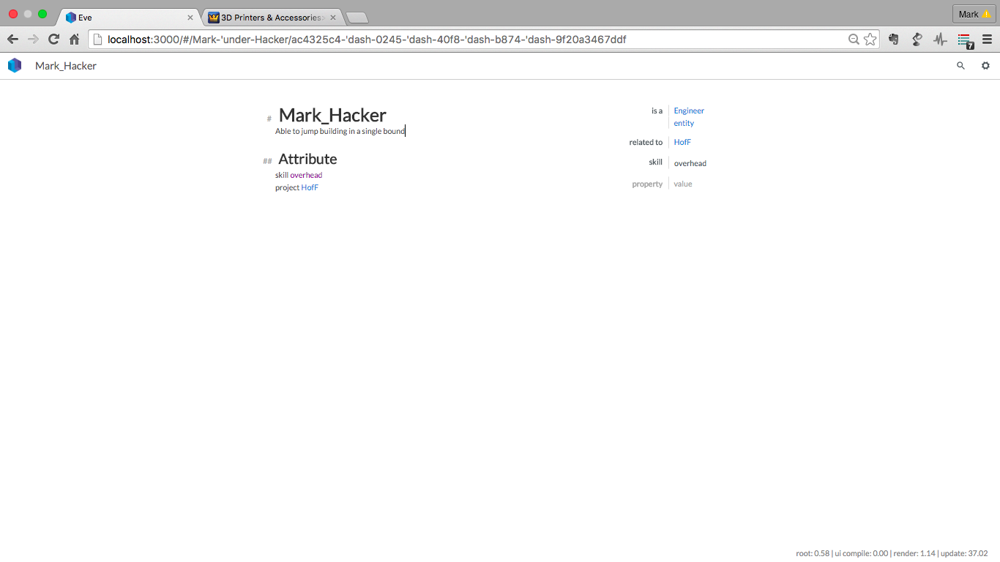

# Eve 
---
So you've found **Eve**, good choice, you're looking to unleash the power of your computer but to do real work, not simple examples, but with out getting bogged down in lines and lines of code to do even the simplest of things.
Think Excel, but with rocket boostera, for the web world.  
Eve is still under development however you'll experiance the potential and vision of a compelete re-thinking of how we programme and play with our data.

## Installation
As Eve is still very much in development, some understanding of development, OS's, shells, Git, etc, system is required. 
Expect bugs, strange things, and pits to fall in, and constant change,
You'll need Git, node, brew and various other development tools installed.  
You'll need some knowledge about these things, there is too much layered understanding to cover in this introduction. Yon need to know a little bit of whats under the computers 'hood'. If you get errors go google, you wont find it here. Eve's been developed on Mac, I'm running a Mac.  Therefore if your 'off-piste' you're alone. 

First grab the lastest code from Git.
``git clone XXXX``

Once you have the git reposity, It's a good idea to keep it up dated.
From inside the directory:

``git pull``

Do this regualary - keeps things intresting and up to date.

Now install **Eve**. Again from the Eve directory

``npm install``

This will take some time to compile and to get whats its needs.

`` npm run dev``

It will take some time to get eveything ready. Done?
Point your browser, recommend Chrome, to 

``http://localhost:3000/``

### Ready?
You should see the home screen something like this - I won't keep repeating myself but, it may look simular or totally different, things are always changing, Enjoy.  If you dont enjoy this - then best check back on **Eve** in a year or so. Either way no more warnings.


Once you have this we are ready to meet **Eve**.
Notice the **Eve** Icon on the top left?  Next is the Eve command bar.  The rest are web like pages and links.  Have a play, when your ready we'll begin.

## Example
The example I am going to build is a resource management system. It has the concept of **Engineers** and **Projects**.  Like all good things - Engineers get allocated to projects, and we'll use **Eve** query capabilites to see whats going on. 

Eve lets you cut and create data in different ways, it has a data logic programme language at its core, so it flexible.  It's an open system therefore you must think a little bit about what you want and how best to represent it, however this is not, normally, tricky as you know the problem and create what you need to represent it.

For the Resource system we will have Engineers, with skills, and Projects with start and stop dates.

Lets start by entering a Engineer, just dive straight in, Eve will catch you.
In the command line type, at the top, type the engineers name;

``Mark_Hacker``


Eve does not know about this top talent yet! Eve lets you create the page and we can expand the system by start adding links, refernaces and properties.

Just start typing under the name.  You can add a discription about the engineer. Any infromation you like.

It understands _some_ markdown, thereore ```#``` is used to denotes headers, for example

``` ##Attributes ```

However to make things intresting, lets start to add some programmatic data.

Then type:
`` skill  =``

Hopefully you'll see Eve starting to take over - you now want to set the values and properties. Via the pop up menus it lets you create and modify new properties and relations.  And thats it.  Thats where the power lies.  Create pages however you want, you can then link and relate them, while adding properties.  This can then be searched, sorted, formatted on other pages and so the interlinking continues.



It will also do tables and iamges.

To be continued...

