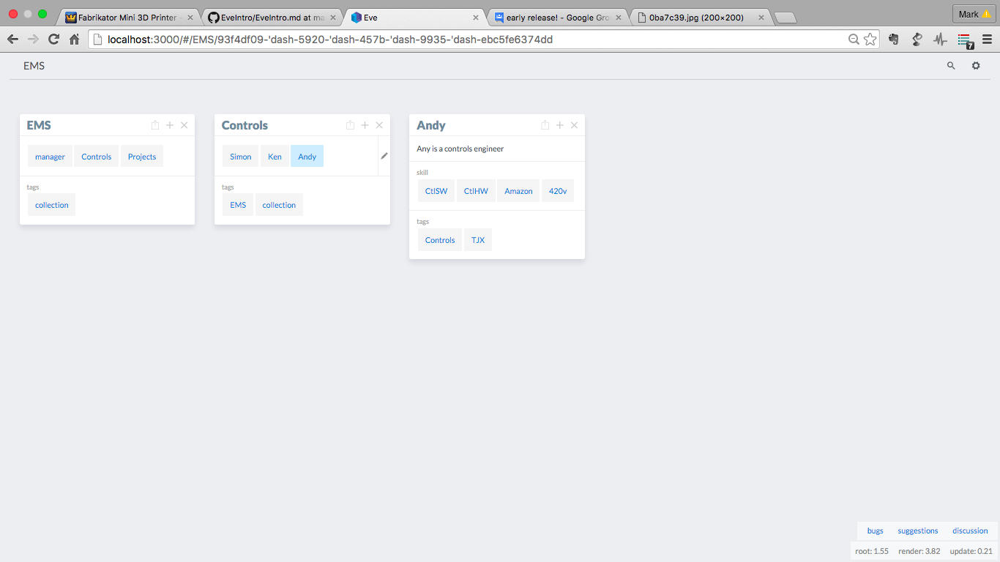

# Eve 
---
So you've found **Eve**, good choice, you're looking to unleash the power of your computer but to do real work, not simple examples, but without getting bogged down in lines-and-lines of code to do even the simplest of things.
Think Excel, but with rocket boosters, for the web world.  
Eve is still under development, however you can still experience the potential and vision of a complete re-thinking of how we 'program' and play with our data.

## Installation
As Eve is still very much in development, some understanding of development (OS's, shells, Git, etc.) type systems are required. 
Expect bugs, strange things, and pits to fall into, and **constant** change.
You'll need Git, node, brew and various other development tools installed.  
You'll need some knowledge about these things, there is too much layered understanding to cover in this introduction. You'll need to know a little bit of whats under the computers 'hood'. If you get errors; go google, you wont find it here. **Eve** has been developed on Mac, I'm running a Mac.  Therefore if your 'off-piste' you're alone. 

First grab the latest code from Git.

``git clone https://github.com/witheve/Eve.git``

Once you have the git repository, It's a good idea to keep it up dated.
From inside the directory:

``git pull``

Do this regularly - keeps things interesting and up to date.

Now install **Eve**. Again from the **Eve** directory

``sudo npm install``

I found that I had to use 'sudo' to allow **Eve** to work due to write permissions for various folders.

This will take some time to compile and get what it needs.

``sudo npm run dev``

It will take some time to get everything ready. Done?
Point your browser, recommended Chrome, to 

``http://localhost:3000/``

or there is demo online

``http://early.witheve.com/``

### Ready?
You should see the home screen something like this - I won't keep repeating myself, but it may look similar or totally different, things are always changing, Enjoy.  If you don't enjoy this - then best check back on **Eve** in a year or so. Either way no more warnings.

Once you have this we are ready to meet **Eve**.
Notice the **Eve** Icon on the top left?  Next is the **Eve** command bar.  The rest are web like pages and links.  Have a play, when your ready we'll begin. Explore the universes planets.

## Example
The example I am going to build is a resource management system. It has the concept of **Engineers** and **Projects**.  Like all good things - Engineers get allocated to projects, and we'll use **Eve** queries capabilities to see whats going on.

**Eve** lets you cut and create data in different ways, it has a data logic programme language at its core, so it flexible. 

**Eve** has the concept of **cards**, **collections** and **properties**.  Cards the backbone of the data set, they can have properties and be gathered into collections. Cards have a description and can have an image.
All of which can be searched and programmatically accessed.

It's an open system therefore you must think a little bit about what you want and how best to represent it, however this is not, normally, tricky as you know the problem and therefore just create what you need to represent it.

For the Resource system we will have Engineers, with skills, and Projects with start and stop dates.
Each engineer will have a card.   Skills will be added as properties to each.  

Each Project will also be a card which we will add engineers as a collections.  Therefore you know which engineers are allocated to which project. They will be also collected together in a project card collection.

Lets start by entering an Engineer, just dive straight in, **Eve** will catch you.
In the command line type, at the top, put the engineers name;

``Andy``

**Eve** does not know about this top talent yet! **Eve** lets you create the page.  We will just expand on the card by adding links, references and properties.

Hit the ``+`` key and add a description, via the description tile, click the tick once you're done. 

Engineers have skills, they are added by Properties. Again Press the ``+`` button and hit the properties files

Now the engineers have skills

See the icon of a Box with an up arrow?  That sets that card to be the root card, most to the left, to allow you stack cards and explore further.

**Eve** now lets us group things together into collections, the grouping depends on what you are doing. For this resource management system, the EMS, we have Controls Engineers, Mech Engineers and managers.  Which are allocated to Projects.

So we create those cards, and we create an EMS card. Then add manager, control, mech and projects, via collections, to the EMS card. This can then quickly be accessed by typing ``ems`` into the command bar.

Adding collections to cards RE easy, click the ``+`` again, collection tile and just type the card you want to add to the collection within the card.  You can just keep adding them in the same operation. Finish with click-the-tick. They can also be deleted by editing the collection, pen icon that appears when hovering over the collection, select the card to delete, it will turn red, and click-the-tick.

This is simple yet powerful; cards, properties and collections allow you to organise your data in many ways that allow you to create relations and databases of your data.  Just have a quick think how best to do it beforehand.

The managers card is added in the same way, new card; Manager, add the engineers to the collection.

Now lets add some projects.

Now the clever stuff

You'll simple add the engineer card, Andy, into the project collection.

You can build and links cards together into collections.  The collection can made however the data is needed.  The collections are simply created by ``+`` then click on collection tile.  Just type card (or a collection -nice) that you want to link.  This quickly makes complex webs of data that are simple to easy and navigate and are always in context. Andy is an engineer, who's in controls, who on the TJX project - all just by quick clicks and hops.

You can add properties - anything that make sense - to a card.  They can then be used in more powerful ways, as we'll see with search and query.

### Add Images and Descriptions

Once you started added cards you may want to build upon them.  Eve lets you add text descriptions and images.

Try exploring the planets again.

Adding a description is easy, ``+`` then click on the Description tile.  In the text add what you like, click the tick.

Images (due to web security issues) need to be hosted somewhere, but again are added  ``+``, images.  Copy the URL, click-the-tick.

Hosting images can be a pain <roadmap?> I use Github, add an annoying step in an otherwise simple process.

## Search and query
Now that we have built the data, which we can readily navigate, adding search and query lets us go deeper.

### Search
Search is simple, just search for what you want in the **Eve** bar, it will become the root level card. For example

``Andy``

Will bring the Andy card to the top level. 

Search is fuzzy which means it's more like google, it will look past capital letters, spaces, underscore etc.

Therefore, try ``EMS`` and ``ems``.  This is nice because it makes **Eve** human and accessible due to this little imprecision.

Deeper searches which results in tables? Try ``project start``.  Project is a card collection, and start is properties - the search makes the connection for you.

That's a table generated - which can be made into a card - giving all your project start dates - a range of properties across cards.

### Query
**Eve**'s query lets you do a little more.  It's based on 'natural language' so that you build english like sentences to ask questions about your data.  

Try some of the following:

``how many controls?``

Presents you with a nice table - which you can save as another card 

More 'programmatic'

``count control``

Gives a simple card, with the count.  You can dismiss it, or save (add) it as a card for future reference.

``count control amazon``

Will count all the control engineers with amazon knowledge.
So it tries to understand both your cards and properties.

Then ``control amazon`` lists them - then they are just a click away

Think google for your data.

## REPL
Eve also has REPL, Read–eval–print-loop, system for the brave and allows you to venture deeper.

``sudo npm run dev`` 

WHICH IS BROKEN AT THE MOMENT :-(

---

                ,'`.          
             ,'      `.       
          ,'`.        | `.    
       ,'      `.     |    `.
      |`.     ,' |    |     | 
      |   `.'    |    |     | 
      |    |     |  ,'`.    | 
      |    |     |'      `. | 
       `.  |     `.        ;' 
          `|,       `.  ,'   
             `.      ,'      
                `.,'         

